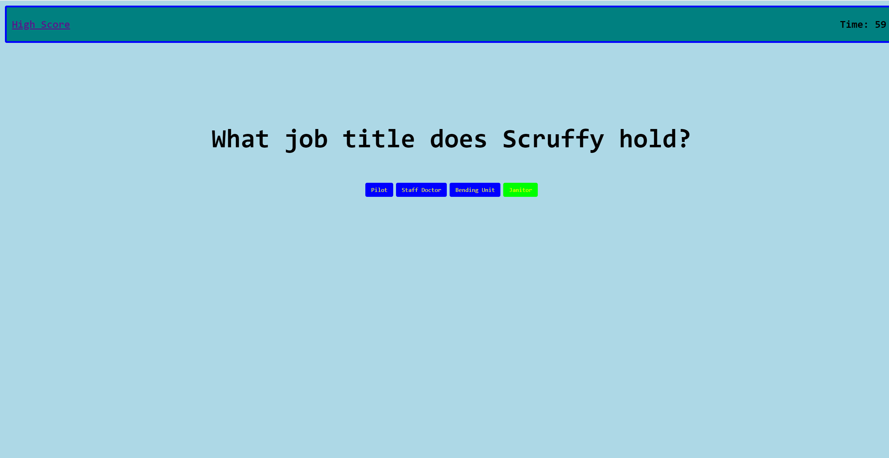

# Quiz Application

Quiz specifications:

When the Start button is clicked a timer starts and the user is prompted with a question.

Whe the question is answered the user is given another question. 

When a question is answered incorrectly, time is subtracted from the clock. When the quiz is finished OR the timer runs out, the quiz is over. The user is then prompted to save their initials and score.

  
Link to deployed page here: <a href="https://helenil.github.io/Quiz/">https://helenil.github.io/Quiz/</a> ,br
h2>Technologies used:</h2> 
HTML, CSS, BOOTSTRAP CDN  
<h2>Credits:</h2>
Helen Lindberg 
Email: helenilindberg@yahoo.com 
GitHub Profile: <a href="https://github.com/HelenIL">https://github.com/HelenIL</a>  
